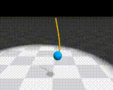
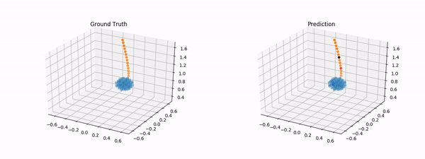
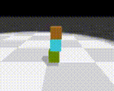
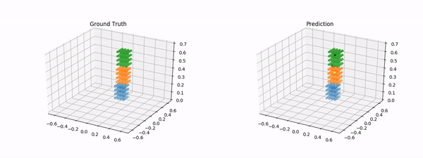

# VGPL-Visual-Prior

PyTorch implementation for the visual prior componenet (i.e. percetion module) of the Visually Grounded Physics Learner (VGPL).
Given visual obseravtions, the visual prior proposes their corresponding particle representations, in the form of particle positions and groupings. Please see the following paper for more details.

**Visual Grounding of Learned Physical Models**

Yunzhu Li, Toru Lin*, Kexin Yi*, Daniel M. Bear, Daniel L. K. Yamins, Jiajun Wu, Joshua B. Tenenbaum, and Antonio Torralba

**ICML 2020**
[[website]](http://visual-physics-grounding.csail.mit.edu/) [[paper]](https://arxiv.org/abs/2004.13664) [[video]](https://www.youtube.com/watch?v=P_LrG0lzc-0&feature=youtu.be)

## Demo

Ground truths and predictions from our learned model

 

 

## Prerequisites

- Python 3
- PyTorch 1.0 or higher, with NVIDIA CUDA Support
- Other required packages in `requirements.txt`

## Code overview

### Helper files

`config.py` contains all configurations used for model training, model evaluation and output generation.

`dataset.py` contains helper functions for loading and standardizing data and related variables. Note that paths to data directories is specified in the `_DATA_DIR` variable in this file, not in `config.py`.

`loss.py` contains helper functions for calculating Chamfer loss in different settings (e.g. in a single frame, across a time sequence, etc.).

`model.py` implements the neural network model used for prediction.

### Main files

The following files can be run directly; see "Training and evaluation" section for more details.

`train.py` trains a model that could convert input observations into their particle representations.

`eval.py` evaluates a trained model by visualizing its predictions, and/or stores the output predictions in `.h5` format.

## Training and evaluation

Download the training and evaluation data from the following links, and put them in the `data` folder.

[[MassRope]](https://www.dropbox.com/s/j5lla86qsurjn1k/data_MassRope.zip?dl=0) [[RigidFall]](https://www.dropbox.com/s/ho8lgi35se75irh/data_RigidFall.zip?dl=0)

See `config.py` for more details on customizable configurations.

To train the model:

`python train.py --set loss_type l2 dataset RigidFall`

To debug (by overfitting model on small batch of data):

`python train.py --set loss_type l2 dataset RigidFall debug True`

To evaluate a trained model and generate outputs:

`python eval.py --set loss_type l2 dataset RigidFall n_frames 4 n_frames_eval 10 load_path [path]`

## Citing VGPL

If you find this codebase useful in your research, please consider citing:

    @inproceedings{li2020visual,
        Title={Visual Grounding of Learned Physical Models},
        Author={Li, Yunzhu and Lin, Toru and Yi, Kexin and Bear, Daniel and Yamins, Daniel L.K. and Wu, Jiajun and Tenenbaum, Joshua B. and Torralba, Antonio},
        Booktitle={ICLR},
        Year={2020}
    }

    @inproceedings{li2019learning,
        Title={Learning Particle Dynamics for Manipulating Rigid Bodies, Deformable Objects, and Fluids},
        Author={Li, Yunzhu and Wu, Jiajun and Tedrake, Russ and Tenenbaum, Joshua B and Torralba, Antonio},
        Booktitle={ICLR},
        Year={2019}
    }
